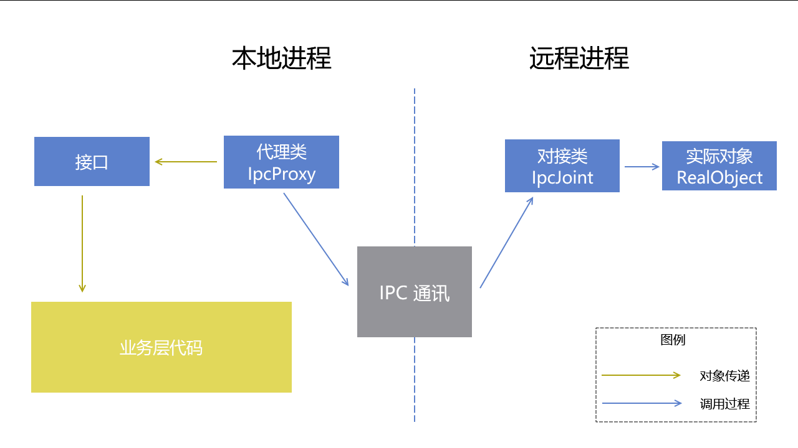

# IpcRemotingObject

使用 .NET Remoting 模式的对象远程调用的 IPC 通讯方式。

## 概念

在 .NET Remoting 里，可以在当前进程里拿到一个对象，这个对象的实际执行逻辑是放在另一个进程执行的。此设计的优势在于，业务层拿到一个对象，可以无视此对象实际 IPC 通讯细节。

## 顶层使用方法

顶层业务层使用这一套可以分为两个步骤：

1. 获取远程对象；
2. 使用对象。

获取远程对象需要两个先决参数，分别是本地 IPC 提供器 IpcProvider 以及服务端的代理 PeerProxy 对象。在本 IPC 框架里，约定了使用 IpcProvider 类型提供 IPC 的通讯接口，使用 PeerProxy 代表一个远程 IPC 对象。

在 IpcRemotingObject 机制里，需要通过 IpcProvider 进行基础的通讯逻辑，通过 PeerProxy 了解服务端是谁。

假定有 IIpcJointTestObject 接口，此接口将定义 IPC 远程调用对象，获取此远程对象可用如下代码：

```csharp
var ipcJointTestObjectProxy = ipcProvider.CreateIpcProxy<IIpcJointTestObject, IpcJointTestObjectIpcProxy>(peerProxy);
```

通过如上代码即可拿到 IIpcJointTestObject 类型的 ipcJointTestObjectProxy 对象。

其他任何业务逻辑里面，使用 ipcJointTestObjectProxy 对象就和使用其他对象一样，无须特殊考虑。

## 逻辑定义

大部分情况下，以下逻辑定义，除了实际的类型逻辑代码外，其他的都由工具自动生成。为了展示更多的细节，以下将列出一个 IPC 远程调用对象的定义方式。

框架约定的远程调用对象的定义包括如下部分：

- 接口定义：所有给到业务层使用的，都必须要求通过接口出发。决策原因是在 .NET Core 或以上版本，透明代理对接口更加好友。通过接口方式可以在不动用任何黑科技，即可完成全框架开发。
- 实际逻辑：实际的类型的逻辑，此逻辑将在远程执行。
- 代理类：用于给本地使用的代理类型，继承远程调用对象的接口定义和 GeneratedIpcProxy 类型。在代理类里面，所有的成员都应该调用 IPC 通讯，调用远程的对象进行处理逻辑。
- 对接类：继承 GeneratedIpcJoint 的类型，用于对接 IPC 通讯框架和具体实现逻辑的类型，用于将 IPC 的消息转换为实际调用代码，作为对接 IPC 消息和具体方法或属性调用的类型。



以下采用 IIpcJointTestObject 远程调用对象的定义作为例子。

假定有业务需要 IIpcJointTestObject 接口类型实现业务，此业务具体是在另一个进程（此进程称为远程进程）执行代码逻辑，调用端在当前进程（此进程称为本地进程）进行触发，接口定义如下：

```csharp
    /// <summary>
    /// 定义 IPC 接口
    /// </summary>
    public interface IIpcJointTestObject
    {
        void TestMethod2(string arg1, int arg2);
        Task TestMethod2Async(string arg1, int arg2);

        void TestMethod1();
        Task TestMethod1Async();
    }
```

具体的 IpcJointTestRealObject 对象执行逻辑如下：

```csharp
    /// <summary>
    /// 实际的对象，包含实际的业务逻辑
    /// </summary>
    [IpcPublic(typeof(IIpcJointTestObject), typeof(IpcJointTestObjectIpcProxy), typeof(IpcJointTestObjectIpcJoint))]
    class IpcJointTestRealObject : IIpcJointTestObject
    {
        public void TestMethod2(string arg1, int arg2)
        {
        	// 忽略代码逻辑
        }

        public Task TestMethod2Async(string arg1, int arg2)
        {
            // 忽略代码逻辑
        }

        public void TestMethod1()
        {
            // 忽略代码逻辑
        }

        public Task TestMethod1Async()
        {
            // 忽略代码逻辑
        }
    }
```

此 IpcJointTestRealObject 类型就是实际的执行代码逻辑，按照框架约定，需要给此类型加上 IpcPublic 特性。特性里的 IpcJointTestObjectIpcProxy 和 IpcJointTestObjectIpcJoint 分别是代理类和对接类。这两个类型定义如下：

代理类型的作用是给本地进程所使用的对象，此对象继承远程调用对象的接口定义，也就是 IpcJointTestObjectIpcProxy 代理类型继承 IIpcJointTestObject 接口。但是代理类型没有执行实际的逻辑，所有的成员都是调用 IPC 通讯，让远程执行执行返回结果。

为了方便代理类型调用 IPC 通讯，要求代理类型同时继承 GeneratedIpcProxy 类型，代码如下：

```csharp
    /// <summary>
    /// 这是在 IPC 客户端执行的代码，给 IPC 客户端的各个业务使用的实际对象，此对象里面的所有方法都是调用 IPC 发送请求到 IPC 服务端执行
    /// </summary>
    /// 此为生成代码
    class IpcJointTestObjectIpcProxy : GeneratedIpcProxy<IIpcJointTestObject>, IIpcJointTestObject
    {
        public void TestMethod2(string arg1, int arg2)
        {
            CallMethod(new object[] { arg1, arg2 }).Wait();
        }

        public async Task TestMethod2Async(string arg1, int arg2)
        {
            await CallMethodAsync(new object[] { arg1, arg2 });
        }

        public void TestMethod1()
        {
            CallMethod().Wait();
        }

        public async Task TestMethod1Async()
        {
            await CallMethodAsync();
        }
    }
```

在远程进行收到代理类型发送过来的请求时，需要执行到具体的逻辑，也就是 IpcJointTestRealObject 的代码逻辑。为了让 IPC 发送过来的请求与具体的代码调用关联，应该定义对接类型。对接类将定义某个请求对应具体逻辑的调用方法，如代码：

```csharp
    /// <summary>
    /// 这是在 IPC 服务端执行的代码，用于关联 IPC 客户端发过来的请求的处理方式，如何对应到实际的对象
    /// </summary>
    /// 此为生成代码
    class IpcJointTestObjectIpcJoint : GeneratedIpcJoint<IIpcJointTestObject>
    {
        protected override void MatchMembers(IIpcJointTestObject real)
        {
            MatchMethod(nameof(IIpcJointTestObject.TestMethod1), new Action(() => real.TestMethod1()));
            MatchMethod(nameof(IIpcJointTestObject.TestMethod1Async), new Func<Task>(() => real.TestMethod1Async()));

            MatchMethod(nameof(IIpcJointTestObject.TestMethod2), new Action<string, int>((a0, a1) => real.TestMethod2(a0, a1)));
            MatchMethod(nameof(IIpcJointTestObject.TestMethod2Async), new Func<string, int, Task>((a0, a1) => real.TestMethod2Async(a0, a1)));
        }
    }
```

以上代码里，有以下类型是开发者业务端需要定义的：

- 接口 IIpcJointTestObject 的代码；
- 具体实现逻辑 IpcJointTestRealObject 的代码。

有以下类型是框架的代码生成工具创建的：

- 代理类 IpcJointTestObjectIpcProxy 的代码，这些代码都是相似的；
- 对接类 IpcJointTestObjectIpcJoint 的代码，用于从请求调用具体的对象。

定义完成类型，需要注入到 IPC 框架里才能生效。要求在远程进程里，调用如下代码进行注入：

```csharp
  // 创建实际的对象
  var ipcJointTestRealObject = new IpcJointTestRealObject();

  // 注册关联
  ipcProvider.CreateIpcJoint<IIpcJointTestObject, IpcJointTestObjectIpcJoint>(ipcJointTestRealObject);
```

具体的使用最简例子如下：

```csharp
// 进程1的代码： 
                // A 客户端
                var ipcProviderA = new IpcProvider();
                ipcProviderA.StartServer();

                // 先让 A 连接到 B 上，连接之后，才能向 B 获取到对象代理
                var peer = await ipcProviderA.GetAndConnectToPeerAsync(ipcProviderB.IpcContext.PipeName);

                // 通过在客户端里，创建对象代理，即可拿到代理。代理是给本机使用，但实际执行逻辑，是发送远程调用
                var ipcJointTestObjectProxy = ipcProviderA.CreateIpcProxy<IIpcJointTestObject, IpcJointTestObjectIpcProxy>(peer);

                // 无参，无返回值 同步方法
                ipcJointTestObjectProxy.TestMethod1();

                // 无参，无返回值 异步方法
                await ipcJointTestObjectProxy.TestMethod1Async();

                // 带基础类型参数，无返回值同步方法
                string a0 = "lindexi is doubi";
                int a1 = 2;

                ipcJointTestObjectProxy.TestMethod2(a0, a1);

                // 带基础类型参数，无返回值异步方法
                await ipcJointTestObjectProxy.TestMethod2Async(a0, a1);


// 进程2的代码：
                // B 服务端
                var ipcProviderB = new IpcProvider();
                var ipcJointTestRealObject = new IpcJointTestRealObject();

                // 注册关联
                ipcProviderB.CreateIpcJoint<IIpcJointTestObject, IpcJointTestObjectIpcJoint>(ipcJointTestRealObject);

                // 注册完成再启动
                ipcProviderB.StartServer();
```

通过以上代码可以看到，只有定义远程调用对象，以及注入和获取远程对象逻辑和 IPC 框架相关。如何使用远程对象和 IPC 框架无关。